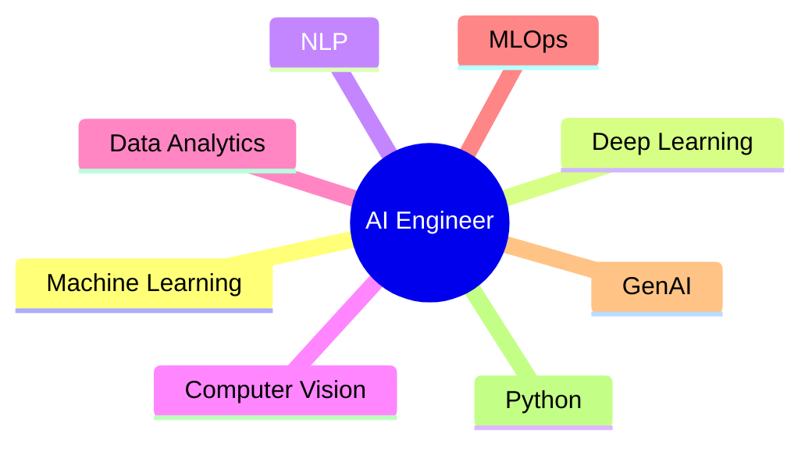

# 🚀 Animated Header

```html
<div align="center">


[](https://git.io/typing-svg)

</div>
```

---

# 💫 About Me

* 💻 Passionate **Front-End Developer**
* 🤖 Learning **Artificial Intelligence & Machine Learning**
* 📊 Interested in **Data Analytics & Data Science**
* ⚡ Focused on **Performance Optimization**
* 🎯 Writing **Clean & Maintainable Code**
* 🌱 Exploring **Deep Learning, NLP & Generative AI**
* 🚀 Building projects that solve real-world problems
* 🤝 Open to internships, collaborations and open-source contributions

---

# 🧠 AI & ML Interests

```text
Machine Learning
Deep Learning
Natural Language Processing
Computer Vision
Data Analytics
Generative AI
Python Automation
Prompt Engineering
```

---

# 🎯 Current Focus

| 🚀 Learning      | 💼 Building       |
| ---------------- | ----------------- |
| Machine Learning | AI Form Generator |
| Deep Learning    | Portfolio Website |
| Data Analytics   | React Projects    |
| NLP              | Python Projects   |
| Generative AI    | Open Source       |

---

# 📈 Coding Analytics

<p align="center">


</p>

<p align="center">


</p>

---

# 📊 GitHub Profile Analytics

<p align="center">


</p>

---

# 🏆 GitHub Achievements

<p align="center">


</p>

---

# 📈 Contribution Graph

<p align="center">


</p>

---

# 🐍 Contribution Snake

<p align="center">


</p>

---

# ⚡ Developer Metrics

<p align="center">


</p>

---

# 🧰 Tech Stack

### 💻 Languages

C++ • JavaScript • Python • SQL

### 🌐 Frontend

HTML5 • CSS3 • React • Tailwind CSS

### 🤖 AI & Machine Learning

Python • NumPy • Pandas • Matplotlib • Scikit-Learn • Anaconda

### 🗄 Database

MongoDB • MySQL

### ⚙ Tools

Git • GitHub • Vercel • Figma • Canva • Framer • Sketch • Notion

---

# 🎓 Currently Learning



---

# 🌎 Connect With Me

Keep your existing social badges here.

---

# 💡 Quote

> *"Building intelligent solutions through clean code, continuous learning, and data-driven innovation."*

---

# 👀 Visitors

```html
<p align="center">

</p>
```

---

```html

```
